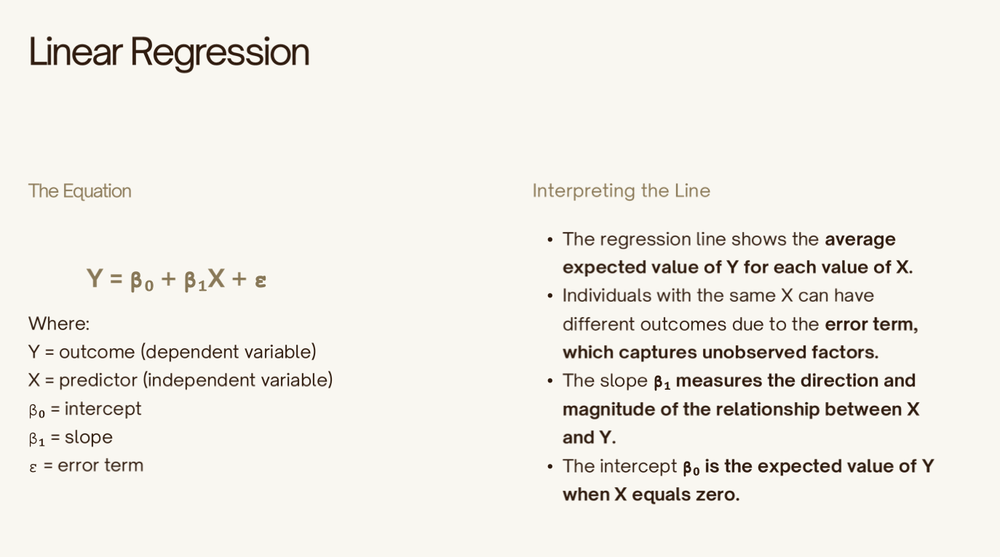
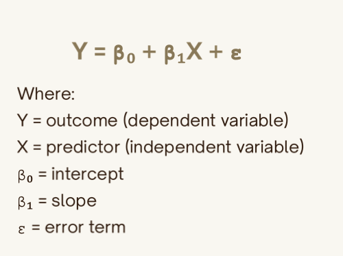
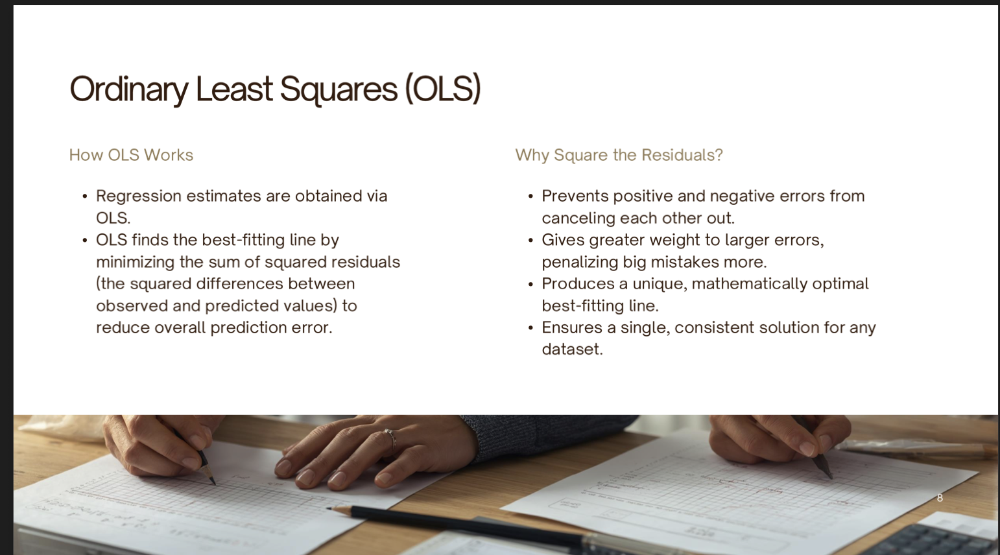
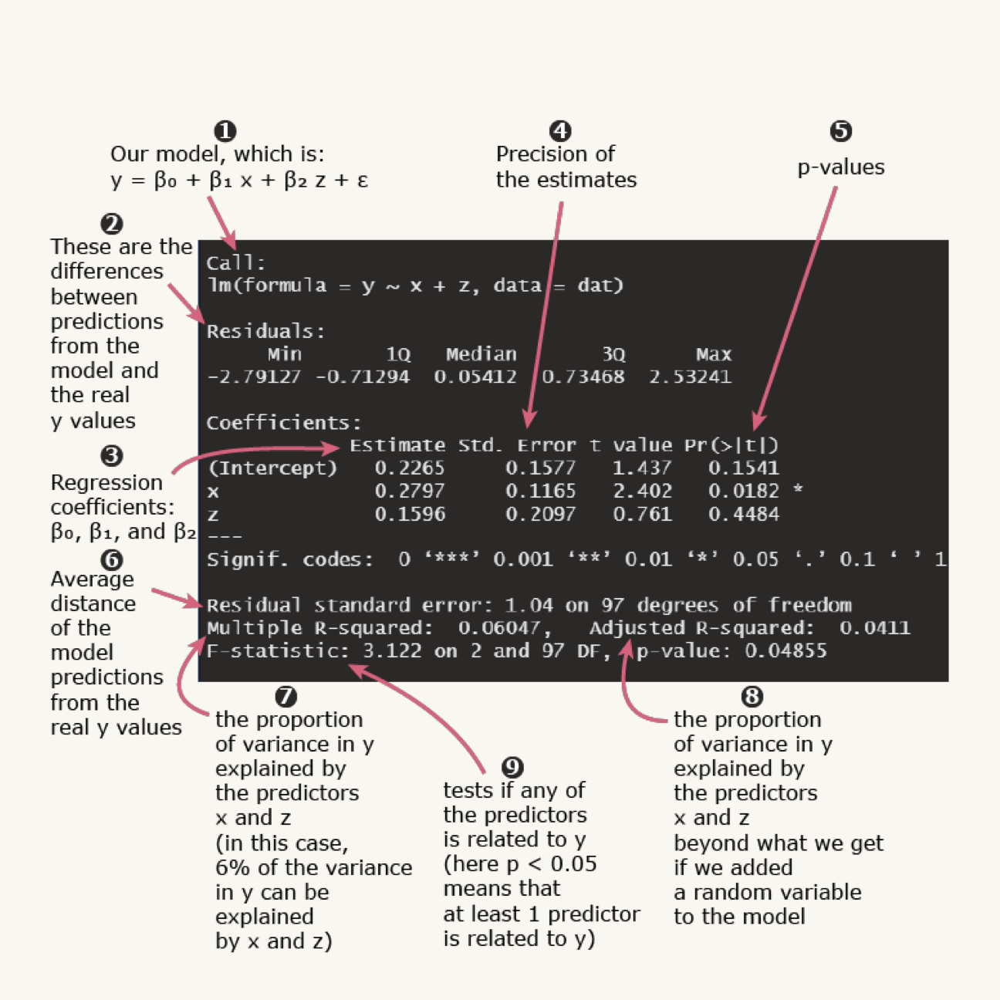

Read
The Prevalence and Economic Value of Doubling Up
Pilkauskas, N., Garfinkel, I., & McLanahan, S . (2014). The Prevalence and Economic Value of Doubling Up. Demography. 51, 1667-1676. DOI 10.1007/s13524-014-0327-4

- The goal of this research was to describe the prevalence of doubling up among families
in large cities and to estimate the rental savings to mothers who were doubled up in someone else’s household.
- On average, 24 % of mothers are doubled up at any survey wave, and nearly one-half of mothers are doubled up at some point during the first nine years of their child’s life. 
-  Overall, doubling up serves as an important private safety net: it is used frequently and is economically valuable.

Homeownership and Rent
* If a mother reports "owning a home", she is coded as a 'homeowner'.
* "Otherwise", she is coded as a 'renter'.
    * Excludes mothers who are homeless or living in a shelter.

Rent and Mortgage Information
* Renters are asked:
    * “How much rent do you pay each month?”
    * Monthly rent is used to calculate yearly rental payments.
* Homeowners report:
    * Annual mortgage payments.

Additional Housing Information
* Mothers report whether they:
    * Live in a home they own.
    * Live in a home owned by someone else.
* Renters are also asked:
    * Whose name is on the lease?

Final Housing Categories
The study classifies mothers into one of the following groups:
* Own their own home.
* Live in a home owned by another person and pay no rent.
* Live in a home owned by another person and pay rent.
* Rent their own home (or their partner rents).
* Live in a home rented by another person and pay rent.
* Live in a home rented by another person and pay no rent.

Differences by Relationship Status
* Single mothers are much more likely to double up than married or cohabiting mothers.
* A substantial share of married mothers also double up.
* Cohabiting mothers are more likely to live with nonkin than single or married mothers.
    * This is consistent with research suggesting that relatives are more willing to help single mothers and married-parent households than cohabiting families (Seltzer et al., 2012).
* As expected, single mothers are much less likely to bring others into their home:
    * Single mothers: 41%
    * Married mothers: 76%
    * Cohabiting mothers: 64%

Lecture    
- Problem Set 2 is posted online, 
- By the end of class, Thursday, you should have everything you need in order to complete problem set 2
- Whenever you start an analysis, you must do some kind of manipulation of data. New variable you are creating to serve your needs. You can do all kinds of manipulation, imagine working with 6 categories and of a variable. Simplification helps with doing analysis. For example, race and ethnicity. I have 5 groups but my study is only about the Hispanic population, so I create a singel variable for the hispanic population. In our dataset, we have 4 derived variable, that provide info that if a staff worker has received professional development. It tells you if it was a coach session, meeting session, or taking a course in a college. You 4 that tell you yes or no. She is asking us to create one varible that combines those 4, If any of those are Yes, then the created variable will be Yes, if no, then no.
- Youo can create any kind of variable using the data you have. Depending on the variable, you may have to do a specific analysis
- The linear regression is the most widely used to understand associations between outcomes and predictors. 
Outcome variable -  
Predictor variable - 

Linear regression tries to find the association between the dependent variable and the other. 

Class 5, Slide 4
What Researchers Use It For
• Describe relationships between variables.
• Predict outcomes from one or more predictors.
• Estimate how much an outcome changes per unit
change in a predictor.
• Control for other variables that may influence the
outcome.
• Test hypotheses about relationships between
variables.
• Estimate causal effects when design and
assumptions support it.

Maybe you have a hypothesis that income changes with wage. In that hypothesis, you can test it with a linear regression.

Questions that can be answered with a linear regression
- Does education increase earnings?
- Does teacher experience improve student achievement?
- Does participation in a workforce grant increase provider retention?

What does a linear regeression do?
- Only use linear regerssion models for relationships with straight lines, not curved
- Remember though, we rarely have a line, it will be a series of dots.
- The LR summarizes your relationsihp with a line
- Averages usually work when there are no crazy outliers within the data
- 

Homework
- Memorize the basic equation of a linear regression

- Beta 1 tells the magnitude of the variable of interest. If you move one unit to the right, how much your outcome variable changes.
- If you see your graphs that
- The error term accounts for anything else that cannot be measured
- 

Ordinary Least Squares (OLS)

- P value of 5% means 95% confident
- The residuals are the difference between the true data and the predicted data
- Your sample must have more that 30 observations to run an efficient regresssion
- 

Reading a Regression

- Z is just another variable
- If your r squared is close to zero, it might not be predicting much
- Do not try adding random variables in order to get a higher R Squared value
- 

HW
- Try to run, on your own, the Lab 5 session
- Respond to the feedback form