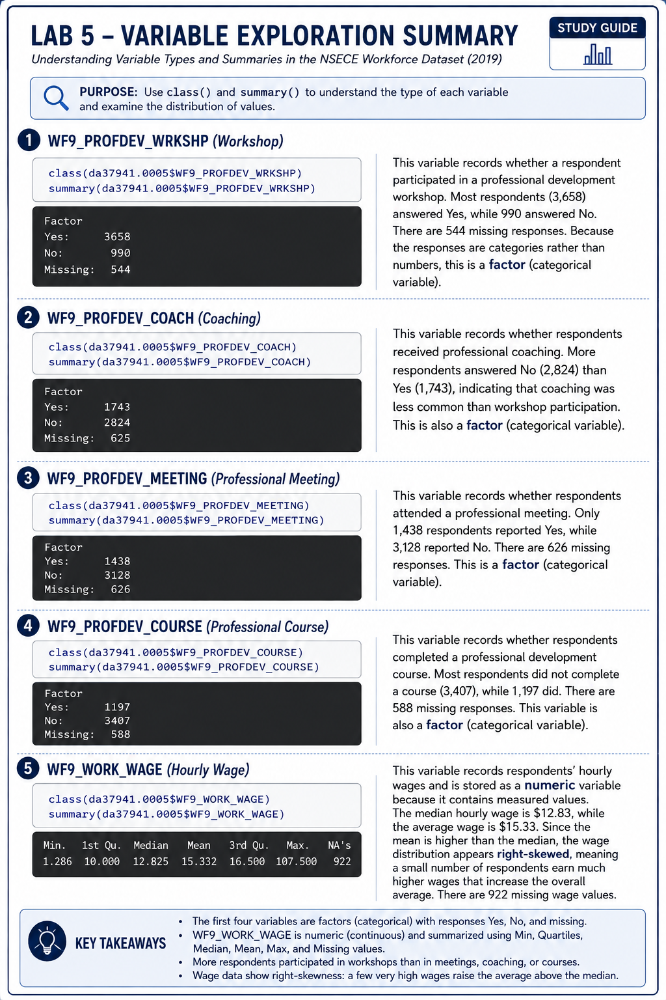

```{r setup, include=FALSE}
knitr::opts_chunk$set(echo = TRUE)
```

#------------------------------------------------------------------------------#
# This file prepares NSECE 2019 data for Lab 5 of the Data for Policy Analysis 
# class.
# PROJECT NAME : Data for Policy Analysis
# DATA SETS USED BY THIS CODE : 37941-0005-Data.rda
# R VERSION : 4.5.3
# AUTHOR : Zachary Johnigan
# DATE CREATED : 08-04-2026
# NOTES : 
#------------------------------------------------------------------------------#

#------------------------------------------------------------------------------#
# 1. Set up working space and import packages
#------------------------------------------------------------------------------#

```{r}
rm(list=ls())
options("error") 
options(lifecycle_disable_verbose_retirement = TRUE)

```

# Import packages

```{r}
package.list <- c("tidyverse", "ggplot2")

for (p in package.list){
  if (!p %in% installed.packages()[, "Package"]) install.packages(p)
  library(p, character.only=TRUE)
}

```

# Set up working directory 

## check your directory
```{r}
getwd()

```

## set up working directory 

```{r}
my_directory   <- "/home/zacharyjohnigan/UChicago_Student/2_Data_For_Policy_Analys_-_Mgmt/"
my_data        <- paste0(my_directory, "Data/")
output_dir     <- paste0(my_directory, "Classes/Class 5/")

```

#------------------------------------------------------------------------------#
# 2. Load dataset
#------------------------------------------------------------------------------#

# Import NSECE 2019 workforce questionnnaire

```{r}
load(paste0(my_data, "37941-0005-Data.rda"))

```

## To import .CSV files use this code
## data <- read.csv("[full directory here]")

#------------------------------------------------------------------------------#
# 3. Basic exploratory data inspection
#------------------------------------------------------------------------------#

# Understand variable class WF9_PROFDEV_WRKSHP,
# WF9_PROFDEV_COACH, WF9_PROFDEV_MEETING, WF9_PROFDEV_COURSE, WF9_WORK_WAGE 
```{r, eval=FALSE}
class(da37941.0005$WF9_PROFDEV_WRKSHP) #factor
summary(da37941.0005$WF9_PROFDEV_WRKSHP) #nominal + discrete

class(da37941.0005$WF9_PROFDEV_COACH) #factor
summary(da37941.0005$WF9_PROFDEV_WRKSHP) #nominal + discrete

class(da37941.0005$WF9_PROFDEV_MEETING) #factor
summary(da37941.0005$WF9_PROFDEV_WRKSHP) #nominal + discrete

class(da37941.0005$WF9_PROFDEV_COURSE) #factor
summary(da37941.0005$WF9_PROFDEV_WRKSHP) #nominal + discrete

class(da37941.0005$WF9_WORK_WAGE) #numeric
summary(da37941.0005$WF9_PROFDEV_WRKSHP) #ratio + continuous 

```

```{r}
class(da37941.0005$WF9_PROFDEV_WRKSHP) # factor
summary(da37941.0005$WF9_PROFDEV_WRKSHP) # nominal + discrete

class(da37941.0005$WF9_PROFDEV_COACH) # factor
summary(da37941.0005$WF9_PROFDEV_COACH) # nominal + discrete

class(da37941.0005$WF9_PROFDEV_MEETING) # factor
summary(da37941.0005$WF9_PROFDEV_MEETING) # nominal + discrete

class(da37941.0005$WF9_PROFDEV_COURSE) # factor
summary(da37941.0005$WF9_PROFDEV_COURSE) # nominal + discrete

class(da37941.0005$WF9_WORK_WAGE) # numeric
summary(da37941.0005$WF9_WORK_WAGE) # ratio + continuous
```

This chunk examines the class and summary of each variable to better understand the dataset before beginning any analysis. The four professional development variables are stored as factors, meaning they are categorical variables with response options such as “Yes” and “No.” The hourly wage variable (WF9_WORK_WAGE) is stored as a numeric variable, meaning it contains continuous numerical values that can be used to calculate statistics such as the mean and standard deviation.

For the output specifically:
The summaries show that each professional development variable contains three possible outcomes: Yes, No, and missing values (NA). In this sample, 3,658 respondents answered “Yes,” 990 answered “No,” and 544 observations were missing. The output also confirms that WF9_WORK_WAGE is numeric, making it appropriate for quantitative analyses such as calculating averages and comparing wages across groups.

#------------------------------------------------------------------------------#
# 4. Basic cleaning and manipulation
#------------------------------------------------------------------------------#

# Rename dataset
```{r}
nsece_2019_wf <- da37941.0005

```

# Subset dataset and rename variables
```{r}
nsece_2019_wf_subset <- 
  nsece_2019_wf %>%
  select(WF9_PROFDEV_WRKSHP, 
         WF9_PROFDEV_COACH, 
         WF9_PROFDEV_MEETING, 
         WF9_PROFDEV_COURSE,
         WF9_WORK_WAGE) %>%
  rename(part_workshop = WF9_PROFDEV_WRKSHP,
         part_coaching = WF9_PROFDEV_COACH, 
         part_meeting = WF9_PROFDEV_MEETING, 
         part_course = WF9_PROFDEV_COURSE, 
         hr_wage = WF9_WORK_WAGE) 

```

# I suggest keeping the factor variables for ordinal variables but work with numeric / character values for all other types of variables.Since all the predictor variables are nominal, I will convert them as character variables.

# Recode professional development variables
```{r}
nsece_2019_wf_recode <- 
  nsece_2019_wf_subset %>%
  mutate(part_workshop_char = as.character(part_workshop), # use mutate() to create new character variables while keeping the original variables unchanged
         part_workshop_char = case_when(
           part_workshop == "(1) Yes" ~ "Yes", # recode the variable responses to simpler labels
           part_workshop == "(2) No" ~ "No"),
           
         part_coaching_char = as.character(part_coaching),
         part_coaching_char = case_when(
           part_coaching == "(1) Yes" ~ "Yes",
           part_coaching == "(2) No" ~ "No"), 
         
         part_meeting_char = as.character(part_meeting),
         part_meeting_char = case_when(
           part_meeting == "(1) Yes" ~ "Yes",
           part_meeting == "(2) No" ~ "No"), 
         
         part_course_char = as.character(part_course),
         part_course_char = case_when(
           part_course == "(1) Yes" ~ "Yes",
           part_course == "(2) No" ~ "No"))
         
```
This chunk creates a new dataset with cleaner versions of several variables. It uses mutate() to add new columns and case_when() to replace coded responses like “(1) Yes” and “(2) No” with the simpler labels “Yes” and “No”. The original variables are preserved, while the new _char variables make the data easier to analyze, graph, and interpret.


!!!!!!!Bookmark_1!!!!!!!

# Create new professional development variable
```{r}
nsece_2019_wf_pd <- 
  nsece_2019_wf_recode %>%
  mutate(pd = ifelse( # use mutate() to create a new variable called pd
    part_workshop_char == "Yes" | part_coaching_char == "Yes" | part_meeting_char == "Yes" | part_course_char == "Yes", 
    1, 0)) # If the respondent answered "Yes" to at least one of the four activities (workshop, coaching, meeting, or course), code pd as 1.
```

# Otherwise, code pd as 0.

## Let's examine the new variable created
```{r}
class(nsece_2019_wf_pd$pd) #numeric
table(nsece_2019_wf_pd$pd) #the variable was created as expected 
summary(nsece_2019_wf_pd$pd) 

```

#------------------------------------------------------------------------------#
# 5. Run linear regression model
#------------------------------------------------------------------------------#

# Model 1: Hourly wage is our outcome variable and pd is the predictor. 

```{r}
lm_wage_pd <- lm(hr_wage ~ pd,
                     data = nsece_2019_wf_pd)

summary(lm_wage_pd)

```

## 1. Create a residual plot

### 1.1 Create a dataset containing residuals and predicted values

```{r}
residual_data <- 
  data.frame(
  fitted = lm_wage_pd$fitted.values,
  residuals = lm_wage_pd$residuals)

```

### 1.2 Create the residual plot

```{r}
residual_plot <- 
  ggplot(residual_data, aes(x = fitted, y = residuals)) +
  geom_point() + # add points showing the residual value for each observation
  geom_hline(yintercept = 0, linetype = "dashed") + # add a horizontal dashed line at zero to show where predictions perfectly match observations
  labs(
    title = "Residual Plot", # add title to the graph
    x = "Fitted Values", # add title to the x-axis 
    y = "Residuals") # add title to the y-axis 

residual_plot

```

# The residual plot shows how far each worker’s actual hourly wage is from the 
# wage predicted by the model. Points above the zero line represent workers whose 
# actual wages are higher than predicted, while points below the zero line 
# represent workers whose actual wages are lower than predicted. The residuals 
# are mostly scattered around zero but the presence of several large positive 
# residuals indicates that some workers earn much higher wages than the model 
# predicts, suggesting that additional factors not included in the model may 
# explain differences in hourly wages.

## 2. Create histogram of the residuals

```{r}
hist_residual <- 
  ggplot(residual_data, aes(x = residuals)) +
  geom_histogram() +
  labs(
    title = "Histogram of Residuals",
    x = "Residuals",
    y = "Count")

hist_residual

```

# The histogram shows that residuals are centered around zero but are not normally 
# distributed. The distribution is right-skewed, with several large positive 
# residuals indicating that the model underpredicts some observations and may be 
# influenced by outliers.

## 3. Interpretation of coefficients

# The intercept represents the predicted hourly wage for individuals who did not 
# participate in professional development (pd = 0).
# Providers who did not participate in any professional development activity had 
# an estimated average hourly wage of $13.20.

# The coefficient represents the average difference in hourly wages between those 
# who participated in professional development and those who did not (a comparison 
# between the two groups).
# Holding everything else constant (although this model only includes one predictor), 
# individuals who participated in at least one professional development activity had 
# hourly wages that were, on average, $2.49 higher than those who did not participate.
# The p-value for pd is <0.05, which indicates that the association between 
# professional development participation and hourly wage is statistically significant.

## 4. Overall model fit 

# R-squared = 0.0066. This means that professional development participation 
# explains approximately 0.66% of the variation in hourly wages. Which means that 
# although professional development participation is statistically significantly 
# associated with higher wages, it explains very little of the overall differences 
# in wages across workers.

## 5. Conclusion

# Professional development participation was positively associated with hourly 
# wages among center-based early care and education staff. Staff who participated 
# in at least one professional development activity earned, on average, $2.49 more 
# per hour than staff who did not participate. However, professional development 
# explained only a small proportion of the variation in hourly wages. Additionally, 
# the presence of outliers, particularly within the hourly wage variable, may have 
# influenced the regression results. These findings describe an association and 
# do not provide evidence of a causal relationship between professional development 
# participation and wages.   