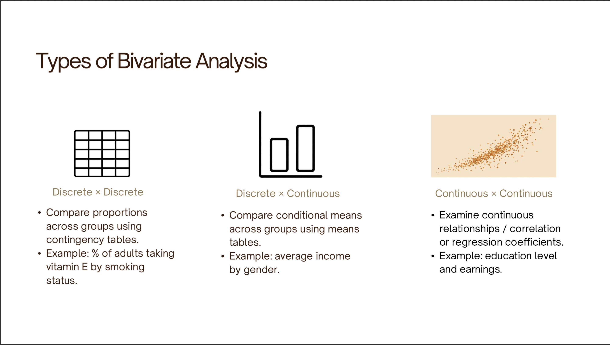

Zachary Johnigan
Aida Pacheco-Applegate
Data For Policy Analys/Mgmt SSAD 48500/1 [60558]
Due: Sun Aug 2, 2026 11:59pm

\centering
ProblemSet_1

1. Prepare the data for analysis.
[x] Subset the NSECE dataset to include the following variables:
o WF9_WoRK_WAGE (hourly wage)
o WF9_WoRK_RoLE (staff role)
o WF9_WoRK_YRS (number of years worked in the program)
o WF9_CHAR_HISP (Hispanic/Latino ethnicity)
o WF9_CHAR_RACE (race)
o WF9_CHAR_EDUC (highest level of education completed)
o WF9_CHAR_GENDER (gender)

[x] Rename the variables using clear, descriptive names.
[-] Perform any data cleaning you consider necessary.
[x] For each variable, identify its level of measurement (nominal, ordinal, or
interval/ratio) and whether it is discrete or continuous.
[-] Include the appropriate descriptive statistics, tables, or graphs, as well as measures of central tendency, dispersion, and shape when applicable.

Describe and interpret your findings.
(4 points)

# 1. Set up working space and import packages
```{r}
# This cleans up everything in the "Environment" pane.
rm(list=ls())
options("error")
options(lifecycle_disable_verbose_retirement = TRUE)
```

```{r}
# Import packages
package.list <- c("tidyverse")

# read the `package.list` for the list of packages we will be needing
# Check what packages are installed already
# If any of the packages in the c() list are not currently installed, install them.
# Note: Check the "Packages" tab to verify that they were installed. If they were not, then check the box and click "Install".
for (p in package.list){
  if (!p %in% installed.packages()[, "Package"]) install.packages(p)
  library(p, character.only=TRUE)
}
```

```{r}
# Set up working directory

## check your directory
getwd()

## set up working directory
my_directory   <- "/home/zacharyjohnigan/UChicago_Student/2_Data_For_Policy_Analys_-_Mgmt/"
my_directory

my_data        <- paste0(my_directory, "Data/")
my_data

output_dir     <- paste0(my_directory, "Problem_Sets/Problem_Set_1/")
output_dir
```

# 2. Load dataset
```{r}
# Import NSECE 2019 workforce questionnnaire (since the data is already in R
# format we just need to use the line 52 of this code to load it into our work
# environment)

load(paste0(my_data, "37941-0005-Data.rda"))
```

# 4. Basic cleaning of the data
```{r}
# Rename dataset
nsece_2019_wf <- da37941.0005
```

# Manipulation of the data
# Subset the NSECE dataset to include the following variables:
# Subset the NSECE dataset
```{r}
nsece_2019_wf_subset <-
  nsece_2019_wf %>%
  select(
    WF9_WORK_WAGE,
    WF9_WORK_ROLE,
    WF9_WORK_YRS,
    WF9_CHAR_HISP,
    WF9_CHAR_RACE,
    WF9_CHAR_EDUC,
    WF9_CHAR_GENDER) %>%
  rename(
    hourly_wage = WF9_WORK_WAGE,
    staff_role = WF9_WORK_ROLE,
    number_of_years_worked_in_the_program = WF9_WORK_YRS,
    Hispanic_Latino_ethnicity = WF9_CHAR_HISP,
    race = WF9_CHAR_RACE,
    highest_level_of_education_completed = WF9_CHAR_EDUC,
    gender = WF9_CHAR_GENDER
  )
```

```{r}
nsece_2019_wf_recode <-
  nsece_2019_wf_subset %>%
  mutate(

    gender_char = as.character(gender),
    gender_char = case_when(
      gender == "(2) Female" ~ "Female",
      gender == "(1) Male" ~ "Male"
    ),

    staff_role_char = as.character(staff_role),
    staff_role_char = case_when(
      staff_role == "(1) Aide or assistant teacher" ~ "Aide/Assistant",
      staff_role == "(2) Teacher, instructor, or lead teacher" ~ "Teacher/Lead",
      staff_role == "(3) Other/undetermined" ~ "Other"
    )
  )
```

# Each variable's level of measurement (nominal, ordinal, or interval/ratio) and whether it is discrete or continuous.
According to the 37941-0005-User_guide.pdf, "manual provides information on the 2019 National Survey of Early Care and
Education (NSECE) workforce public-use data files"(), and the lecture we can define each of the 7 variables as follows.

WF9_WORK_WAGE - hourly_wage - Hourly wage for Workforce respondent (top-coded)
Level of Measurement: Ratio, Continuous

WF9_WORK_ROLE - staff_role - Role of Workforce respondent
Level of Measurement: Ordinal, Discreate

WF9_WORK_YRS - number_of_years_worked_in_the_program - Num of years respondent worked in program
Level of Measurement: Ratio, Continuous

WF9_CHAR_HISP - Hispanic_Latino_ethnicity - Respondent is of Hispanic/Latino descent
Level of Measurement: Nominal, Discrete

WF9_CHAR_RACE - race - Respondent's race
Level of Measurement: Nominal, Discrete

WF9_CHAR_EDUC - highest_level_of_education_completed - Highest education level obtained
Level of Measurement: Ordinal, Discrete

WF9_CHAR_GENDER - gender - The respondent’s self-reported gender
Level of Measurement: Nominal, Discrete

# Citations
NSECE Project Team (National Opinion Research Center). (2019). National Survey of Early Care and Education (NSECE), [United States], 2019: NSECE user’s guide for workforce public-use data file (ICPSR 37941). Inter-university Consortium for Political and Social Research.

Pacheco-Applegate, A. (2026). Data for Policy Analysis and Management: Class 2—Data measurement and variables [PowerPoint slides]. Harris School of Public Policy, University of Chicago.


2. Examine the following relationships. For each analysis, include the appropriate
statistical test to determine whether the observed differences or associations are
statistically significant. Interpret your results in the context of the ECE workforce. (4
points)

# My Answer
From lecture 4, we learn that a bivariate analysis describes, compares, and interprets associations between variables.



We also learn about statistical tests for determining whether the observed differences or associations are
statistically significant. There are five tests we can use to perform these analysis, including: Two-sample t-test, Two-sample z-test, ANOVA, Chi-square test and Paired test.

I will specify which test I used for each comparison and what sort of relationship they have—either positive, negative or null.

In a bivariate analysis, one variable defines the groups (explanatory variable)  X  and the other variable is the outcome we measure (response variable) Y

Take hourly_wage and staff_role for example. We can start by asking first; among the respondents, does hourly wage differ by staff role? This seems like an easy question to answer, but we can graph this to show the relationship visually. Let's try a two-sample t-test.

a. Hourly_wage and staff_role
```{r}
# a. Hourly wage and staff role

# Research question:
# Does hourly wage differ by staff role among ECE workers?

wage_by_role <-
  nsece_2019_wf_recode %>%
  select(staff_role, hourly_wage) %>%          # keep only variables of interest
  drop_na(staff_role, hourly_wage) %>%         # remove missing values
  group_by(staff_role) %>%                     # calculate statistics within each role
  summarize(
    n = n(),
    mean_wage = mean(hourly_wage),
    median_wage = median(hourly_wage),
    sd_wage = sd(hourly_wage),
    min_wage = min(hourly_wage),
    max_wage = max(hourly_wage)
  )

wage_by_role
```
The summary statistics show that average hourly wage varies across staff roles, with teachers, instructors, and lead teachers earning a higher average hourly wage than aides or assistant teachers. A graph of this comparison

```{r}
wage_by_role_plot <-
  nsece_2019_wf_recode %>%
  drop_na(staff_role, hourly_wage) %>%
  ggplot(aes(x = staff_role, y = hourly_wage)) +
  geom_boxplot()

wage_by_role_plot
```
The boxplot shows that teachers, instructors, and lead teachers generally earn higher hourly wages than aides or assistant teachers, although there is considerable variation and some outliers within each staff role.

## b. Hourly wage and number of years worked in the program

Take **hourly_wage** and **number_of_years_worked_in_the_program** for example. We can start by asking first; among the respondents, does hourly wage differ depending on the number of years worked in the program? Because both variables are continuous, a scatterplot is an appropriate way to visualize the relationship.

```{r}
# b. Hourly wage and number of years worked in the program

# Research question:
# Does hourly wage differ by the number of years worked in the program among ECE workers?

wage_by_years <-

  nsece_2019_wf_recode %>%

  select(number_of_years_worked_in_the_program, hourly_wage) %>%

  drop_na(number_of_years_worked_in_the_program, hourly_wage) %>%

  group_by(number_of_years_worked_in_the_program) %>%

  summarize(

    n = n(),

    mean_wage = mean(hourly_wage),

    median_wage = median(hourly_wage),

    sd_wage = sd(hourly_wage),

    min_wage = min(hourly_wage),

    max_wage = max(hourly_wage)

  )

wage_by_years
```

The correlation coefficient summarizes the strength and direction of the relationship between years worked in the program and hourly wage.

```{r}
wage_by_years_plot <-
  nsece_2019_wf_recode %>%
  drop_na(number_of_years_worked_in_the_program, hourly_wage) %>%
  ggplot(aes(x = number_of_years_worked_in_the_program,
             y = hourly_wage)) +
  geom_point() +
  geom_smooth(method = "lm")

wage_by_years_plot
```

The scatterplot shows whether hourly wage tends to increase, decrease, or remain relatively constant as the number of years worked in the program increases.

---

## c. Hourly wage and race/ethnicity

Take **hourly_wage** and **race/ethnicity** for example. We can start by asking first; among the respondents, does hourly wage differ across racial and ethnic groups? We can graph this relationship using a boxplot.

```{r}
# c. Hourly wage and race

# Research question:

# Does hourly wage differ by race among ECE workers?

wage_by_race <-

  nsece_2019_wf_recode %>%

  select(race, hourly_wage) %>%

  drop_na(race, hourly_wage) %>%

  group_by(race) %>%

  summarize(

    n = n(),

    mean_wage = mean(hourly_wage),

    median_wage = median(hourly_wage),

    sd_wage = sd(hourly_wage),

    min_wage = min(hourly_wage),

    max_wage = max(hourly_wage)

  )

wage_by_race
```

The summary statistics show whether average hourly wage differs across racial and ethnic groups.

```{r}
wage_by_race_plot <-
  nsece_2019_wf_recode %>%
  drop_na(race, hourly_wage) %>%
  ggplot(aes(x = race, y = hourly_wage)) +
  geom_boxplot()

wage_by_race_plot
```

The boxplot illustrates the distribution of hourly wages within each racial and ethnic group, allowing differences in wages to be compared visually.

---

## d. Hourly wage and educational attainment

Take **hourly_wage** and **highest_level_of_education_completed** for example. We can start by asking first; among the respondents, does hourly wage differ by educational attainment? A boxplot can help visualize this relationship.

```{r}
# d. Hourly wage and educational attainment

# Research question:
# Does hourly wage differ by educational attainment among ECE workers?

wage_by_education <-
  nsece_2019_wf_recode %>%
  select(highest_level_of_education_completed, hourly_wage) %>%
  drop_na(highest_level_of_education_completed, hourly_wage) %>%
  group_by(highest_level_of_education_completed) %>%
  summarize(
    n = n(),
    mean_wage = mean(hourly_wage),
    median_wage = median(hourly_wage),
    sd_wage = sd(hourly_wage),
    min_wage = min(hourly_wage),
    max_wage = max(hourly_wage)
  )

wage_by_education
```

The summary statistics show whether average hourly wage differs across levels of educational attainment.

```{r}
wage_by_education_plot <-
  nsece_2019_wf_recode %>%
  drop_na(highest_level_of_education_completed, hourly_wage) %>%
  ggplot(aes(x = highest_level_of_education_completed, y = hourly_wage)) +
  geom_boxplot()

wage_by_education_plot
```

The boxplot shows the distribution of hourly wages across levels of educational attainment, making it easier to compare wages among respondents with different levels of education.

---

## e. Hourly wage and gender

Take **hourly_wage** and **gender** for example. We can start by asking first; among the respondents, does hourly wage differ between men and women? We can graph this relationship using a boxplot.

```{r}
# e. Hourly wage and gender

# Research question:
# Does hourly wage differ by gender among ECE workers?

wage_by_gender <-
  nsece_2019_wf_recode %>%
  select(gender, hourly_wage) %>%
  drop_na(gender, hourly_wage) %>%
  group_by(gender) %>%
  summarize(
    n = n(),
    mean_wage = mean(hourly_wage),
    median_wage = median(hourly_wage),
    sd_wage = sd(hourly_wage),
    min_wage = min(hourly_wage),
    max_wage = max(hourly_wage)
  )

wage_by_gender
```

The summary statistics show whether average hourly wage differs between men and women.

```{r}
wage_by_gender_plot <-
  nsece_2019_wf_recode %>%
  drop_na(gender, hourly_wage) %>%
  ggplot(aes(x = gender, y = hourly_wage)) +
  geom_boxplot()

wage_by_gender_plot
```

The boxplot shows the distribution of hourly wages for men and women, making it easier to compare differences in wages between the two groups.


Citations
Pacheco-Applegate, A. (2026). Data for Policy Analysis and Management: Class 4—Bivariate descriptive statistics and basic statistical tests [PowerPoint slides]. University of Chicago.


3. Policy implications. Based on your analyses, describe the segment(s) of the ECE
workforce that appear to be most affected by low wages. What characteristics would
you consider when designing a policy to improve compensation in the ECE sector?
Support your answer using evidence from your analyses. (2 points)

Based on my analyses, aides and assistant teachers appear to be the segment of the ECE workforce most affected by low wages, as they had the lowest average hourly wage compared with teachers, instructors, and lead teachers. The analyses also suggest that hourly wages differ across race, educational attainment, gender, and years worked in the program, indicating that compensation varies across multiple workforce characteristics. When designing a policy to improve compensation in the ECE sector, I would prioritize raising wages for lower-paid staff roles while also considering differences in education, experience, and demographic characteristics. Targeting these factors could help reduce wage disparities and improve equity across the ECE workforce.
